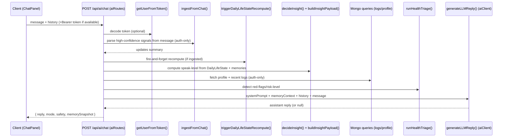

# LifeSync AI Assistant — How it Works (Detailed)

This document describes how the LifeSync AI assistant works end-to-end in the current codebase: request flow, auth & privacy behavior, mode routing, safety triage, insight gatekeeping, “memory context” injection, deterministic learning from chat, and LLM provider configuration.

> Scope note
>
> - This doc explains **mechanics** (how requests are handled, what data is used, what constraints apply).
> - It does **not** attempt medical correctness or diagnosis; the system explicitly avoids that.

---

## 0) Design contract (Life OS behavior)

- **Deterministic first**: routing, safety triage, insight gating, and chat ingestion are rules-based.
- **Silence is the default** for cross-day “insight speech”; the system only escalates when confidence and consent allow it.
- **LLM is a narrator**: it renders an answer within constraints; it does not “discover” patterns.
- **No medical diagnosis / prescriptions**: the system uses triage language and conservative phrasing.

---

## 1) Primary entrypoint

### Client → Server

The UI sends chat messages from:

- Client component: `client/src/components/ChatPanel.jsx`
- Endpoint: `POST /api/ai/chat`
- Payload: `{ message: string, history: Array<{ role: 'user'|'assistant', content: string }>, skipIngestion?: boolean, dayKey?: string }`

The client **includes the JWT token** (if logged in) as:

- `Authorization: Bearer <token>`

### Request/response shapes (practical)

Request body:

```json
{
  "message": "string",
  "history": [{ "role": "user|assistant", "content": "string" }],
  "skipIngestion": false,
  "dayKey": "YYYY-MM-DD"
}
```

Notes:

- `history` is typically trimmed client-side to the last ~12 turns.
- `skipIngestion` is used mainly after explicit ingestion commit, to avoid double-logging.
- `dayKey` is optional; when absent, the server infers “today”.

Response body (shape):

```json
{
  "message": "string",
  "mode": "general|medical|therapy|fitness",
  "reply": "string",
  "safety": {
    "risk_level": "low|moderate|elevated|urgent",
    "confidence": 0.0,
    "reason": "string",
    "red_flags": [],
    "doctor_discussion_points": [],
    "medication_awareness": [],
    "disclaimer": "string"
  },
  "supplementAdvisor": null,
  "memorySnapshot": {
    "chatIngestion": { "ingested": false, "dayKey": null, "updates": [] },
    "fitnessCount": 0,
    "nutritionCount": 0,
    "mentalCount": 0,
    "habitCount": 0,
    "habitLogsCount": 0,
    "symptomLogsCount": 0,
    "labReportsCount": 0,
    "ragConfidence": 0,
    "ragCitationsCount": 0
  }
}
```

### Server route

The main orchestration lives in:

- `server/routes/aiRoutes.js`

This file handles:

- optional authentication
- deterministic “intent heuristics” (greeting detection, meta questions)
- chat ingestion (safe learning)
- insight gatekeeper (silence/reflect/insight)
- reading user context (logs/profile)
- mode routing (general/medical/therapy/fitness)
- safety triage append
- calling the LLM provider layer

---

## 2) High-level flow (sequence)

Mermaid overview (conceptual, matches current logic):



---

## 2.2) Implementation map (chat-related files)

Client:

- `client/src/components/ChatExperience.jsx` — container for chat experience UI.
- `client/src/components/ChatPanel.jsx` — chat UI, history shaping, auth header, voice input, ingestion preview/commit, STT fallback.

Server routes:

- `server/routes/aiRoutes.js` — `POST /api/ai/chat` orchestration: auth, ingestion, gatekeeper, context reads, optional RAG, LLM call, UX guards, triage append.
- `server/routes/chatIngestionRoutes.js` — `POST /api/chat-ingestion/preview|commit` (auth required).
- `server/routes/sttRoutes.js` — `POST /api/stt` (auth required).

Server services (deterministic):

- `server/services/assistant/router.js` — `detectAssistantMode()` (deterministic mode routing).
- `server/services/assistant/prompts.js` — `buildSystemPrompt()` (mode-specific system prompts).
- `server/services/safety/healthTriageEngine.js` — `runHealthTriage()` (deterministic red-flag and risk-level triage).
- `server/services/chatIngestion/ingestFromChat.js` — deterministic extraction of high-confidence signals → writes logs.
- `server/services/dailyLifeState/triggerDailyLifeStateRecompute.js` — async fire-and-forget DailyLifeState recompute trigger.
- `server/services/insightGatekeeper/decideInsight.js` — decides `silent|reflect|insight` from derived state + memory.
- `server/services/insightGatekeeper/insightPayload.js` — converts decision → strict output constraints.

Server services (external calls):

- `server/aiClient.js` — `generateLLMReply()` provider selection + fallback (Groq/Gemini/OpenAI).
- `server/services/ragClient.js` — `fetchTextbookRag()` external call to AI service for citations.
- `server/services/stt/googleStt.js` — Google STT integration (called by `/api/stt`).

## 2.1) Related endpoints (voice + ingestion)

Besides `POST /api/ai/chat`, the chat experience can use:

- `POST /api/chat-ingestion/preview` (auth required)
- `POST /api/chat-ingestion/commit` (auth required)
- `POST /api/stt` (auth required, server speech-to-text fallback)

These are used by the voice-confirm UI so the user can approve what gets logged.

### Voice input flow (client)

Implemented in `client/src/components/ChatPanel.jsx`.

The voice button attempts, in order:

1) **Browser speech recognition** (no server call):
   - Uses `window.SpeechRecognition` / `window.webkitSpeechRecognition` if available.
   - Uses interim results to live-fill the input box.
   - Auto-restarts recognition on short pauses (keeps dictation going) until the user explicitly presses Stop.

2) **Audio upload fallback → server STT** (auth required):
   - Records mic audio via `MediaRecorder` (prefers `audio/webm;codecs=opus`).
   - Uploads multipart form-data to `POST /api/stt` with `audio=<file>`.

After a transcript is produced, the client starts a **voice-confirm ingestion flow**:

- If user is **not signed in**: it sends the chat message normally (no auto-log).
- If signed in:
  - Calls `POST /api/chat-ingestion/preview`.
  - If preview returns `updates[]`, the UI asks: **Save & Send** / **Send only** / Cancel.
  - On “Save & Send”, it calls `POST /api/chat-ingestion/commit` and then sends `POST /api/ai/chat` with `skipIngestion: true` (prevents double-logging the same message).

### `/api/chat-ingestion/preview` + `/commit` contracts

Route: `server/routes/chatIngestionRoutes.js`.

- Both accept JSON `{ "message": "string" }`.
- `preview` runs ingestion in `dryRun: true` mode and returns what *would* be written.
- `commit` performs the write and triggers a DailyLifeState recompute.

Response shape is the same in both (plus `dryRun` boolean):

```json
{
  "ingested": true,
  "dayKey": "YYYY-MM-DD",
  "updates": ["string"],
  "dryRun": true
}
```

### `/api/stt` contract

Route: `server/routes/sttRoutes.js`.

- Method: `POST /api/stt`
- Auth: required
- Body: `multipart/form-data` with field `audio`
- Size limit: 6 MB
- Accepted formats: `.webm` (opus), `.ogg` (opus), `.wav`

Response:

```json
{ "transcript": "string", "provider": "string" }
```

## 3) Authentication & privacy rules

### Optional auth

`/api/ai/chat` supports:

- **Authenticated** users: token resolves to a user; the assistant can read that user’s profile and logs.
- **Unauthenticated** users: no profile/log reads.

### Critical privacy behavior

When not authenticated, the server **does not query logs** with an empty filter.

In `server/routes/aiRoutes.js`, the logs fetch is gated:

- if `userId` exists ⇒ query `{ user: userId }`
- else ⇒ return empty arrays for all log collections

This prevents accidental cross-user data leakage.

---

## 3.1) External call accounting (per user interaction)

This is the practical “how many external calls happen” summary.

### Text chat → `POST /api/ai/chat`

- Typical authenticated, non-medical message:
  - LLM: **1**
  - RAG: **0**
- Medical mode message:
  - RAG: **1** (best-effort)
  - LLM: **1**
  - If `MEDICAL_REQUIRE_RAG=1` and RAG insufficient: **RAG 1, LLM 0** (early return)
- Deterministic fast-path replies (profile questions / greeting / etc.):
  - LLM: **0**
  - RAG: **0**

### Provider fallback (worst case)

When `LLM_PROVIDER=auto`, the provider layer can fall back across providers if one errors. In the worst case this can mean **more than one outbound LLM call** for a single chat message.

### Voice chat (client)

Two variants:

1) Browser speech recognition available (no server STT)
- External: **0 STT calls**
- Then proceeds like normal chat; may also use ingestion preview/commit.

2) Audio upload → server STT fallback
- STT: **1** (`POST /api/stt`)
- Optional ingestion confirmation:
  - preview: **1** (`POST /api/chat-ingestion/preview`)
  - commit: **1** (`POST /api/chat-ingestion/commit`)
- Then chat:
  - LLM: typically **1**

## 4) Mode routing (deterministic)

The assistant chooses a “mode” (persona + safety framing) using a lightweight rules router:

- `server/services/assistant/router.js` → `detectAssistantMode({ message })`

Possible modes:

- `general`
- `medical`
- `therapy`
- `fitness`

The router uses:

- explicit prefixes like `medical:` / `therapy:` / `fitness:`
- keyword scoring (symptoms → medical, anxiety → therapy, workouts → fitness)
- a tie-break so basic “diet/nutrition” without medical keywords stays `general`

### Mode prompts

The system prompt for a chosen mode is built by:

- `server/services/assistant/prompts.js` → `buildSystemPrompt({ mode })`

Key design intent:

- Use deterministic guardrails (no diagnosis, no prescriptions)
- Keep responses helpful but not overly short
- In medical mode: if RAG citations are included, treat them as the only authoritative medical source

---

## 3.2) `/api/ai/chat` branching (what can short-circuit the LLM)

The route in `server/routes/aiRoutes.js` can reply without calling the LLM in several deterministic cases:

- Greetings (`hi`, `hello`, etc.)
- Unauthenticated personal-context questions (asks user to sign in)
- Profile-field questions (e.g., “what’s my diet type”, “what do you know about me”)
- Some “degraded state” messages (returns one grounded line + one small step)
- Some explicit “why/pattern” requests when the gatekeeper returns `reflect` and a low-confidence explanation is available
- Some explicit “insight” requests when a deterministic identity `reasonKey` can be rendered without exposing memory layers

Otherwise the default path is:

- Compute system prompt (mode + constraints)
- Build memory context (auth-only)
- Call `generateLLMReply()`

Finally the route applies global UX guards:

- at most one follow-up question (or none in direct-answer mode)
- explanation must come before any question
- uncertainty phrasing enforcement

## 5) Safety triage (deterministic)

Safety triage runs on **every message**:

- `server/services/safety/healthTriageEngine.js` → `runHealthTriage({ message, user })`

What it does:

- detects red-flag phrases (e.g., chest pain, shortness of breath, self-harm)
- assigns a `risk_level`: `low | moderate | elevated | urgent`
- returns a short summary and suggested doctor discussion points

How it is surfaced:

- By default, triage is appended to the reply only when risk is not low (or red flags exist).

What it does *not* do:

- no medical diagnosis
- no treatment prescription
- no medication dosing or start/stop

---

## 6) Insight Gatekeeper (silence by default → reflection + explanation)

LifeSync separates “normal Q&A” from “insight speech” (patterns / identity-like statements).

The gatekeeper lives in:

- `server/services/insightGatekeeper/decideInsight.js`
- `server/services/insightGatekeeper/insightPayload.js`

### What the gatekeeper reads

It reads **only** derived + memory collections (not raw logs directly):

- `DailyLifeState` (one per user per day)
- `PatternMemory` (active patterns)
- `IdentityMemory` (active identity truths)

### Gate decisions

`decideInsight()` returns a structured decision (not text):

- `silent`
- `reflect`
- `insight`

With fields:

- `reasonKey`
- `confidence`
- `source` (`daily` | `pattern` | `identity`)

### How it becomes "speech constraints" (UPDATED)

`buildInsightPayload()` converts the decision into strict output constraints:

- `reflect` ⇒ **light explanation** (using available profile/logs/DailyLifeState) **+ exactly 1 reflective question** (never reflection-only)
- `insight` ⇒ up to 2 sentences, no questions, neutral tone

**KEY CHANGE:** The system no longer provides reflection-only responses. When gatekeeper returns `reflect`, it combines:
1. Low-confidence explanation using context (profile, recent logs, DailyLifeState)
2. One reflective/clarifying question

**Confidence Ladder (new):**

- **Level 1 — Low confidence (allowed by default):** "Based on limited data...", "May...", "So far..." — used with minimal data
- **Level 2 — Medium confidence:** "Often", "Tends to" — used when patterns appear 3+ times
- **Level 3 — High confidence:** only with active PatternMemory/IdentityMemory

All levels use uncertainty-aware language. No absolute or medical claims at any level.

### Consent / explicit intent gating (UPDATED)

In `server/routes/aiRoutes.js`, the gatekeeper is invoked when:

- User explicitly asks for patterns/why (detected via `detectExplicitInsightRequest(message)`)

Example triggers:

- contains `why`
- mentions `pattern`
- "how come", "I keep getting …", etc.

**NEW:** The system may provide Level 1 (low-confidence) explanations even without explicit insight consent. These are composed from available user context and always state uncertainty explicitly. Identity-level claims (Level 3 high-confidence) remain strictly gated by user consent.
### Response composition for "reflect" (NEW)

When gatekeeper returns `reflect`, the system now:

1. Calls `buildLowConfidenceExplanation()` with available context (user profile, latest logs, DailyLifeState)
2. If explanation exists, uses it; otherwise falls back to gentle reflection-only fallback
3. Always includes exactly one follow-up question

Helper functions (in `server/routes/aiRoutes.js`):

- `buildLowConfidenceExplanation()` — extracts tentative observations from recent data (sleep, stress, energy, mood, activity)
- `buildReflectiveInsight()` — wraps explanation with optional reflective question

Examples:

**Input:** "Why am I so tired?"
**Output:** "Based on the limited data I have so far, your last sleep was 6h and stress was 7/10. Both can affect fatigue. What feels most connected?"

**Input:** "I feel stressed."
**Output:** "From what I see so far, stress hasn't aligned with heavy physical load, which suggests it may be situational. What feels most present right now?"

This applies to all modes, including therapy mode.
---

## 7) Deterministic “chat ingestion” (learning from chat)

LifeSync supports always-on, conservative learning from chat for authenticated users.

### Where it happens

- `server/services/chatIngestion/ingestFromChat.js`
- called from `server/routes/aiRoutes.js`

### What it extracts (intentionally narrow)

From a single chat message, it attempts to extract high-confidence signals:

- sleep hours (e.g. `slept 7h`)
- stress /10 (e.g. `stress 7/10`)
- energy /10
- mood (only if explicit `mood: good/neutral/low/...`)
- water intake (ml or liters)

### Where it writes

It upserts/updates:

- `MentalLog` (sleep/stress/energy/mood)
- `NutritionLog` (water intake increments)

### How it affects DailyLifeState

If ingestion wrote anything, it triggers:

- `server/services/dailyLifeState/triggerDailyLifeStateRecompute.js`

This is “fire-and-forget” via `setImmediate()`, so chat latency stays low.

This is what enables longer-term learning:

Raw logs → DailyLifeState → PatternMemory/IdentityMemory (computed elsewhere)

---

## 8) Building “memory context” for the LLM

The assistant compiles a **read-only context string** for the LLM.

In `server/routes/aiRoutes.js` it builds context from (auth-only):

- user profile fields (diet type, avoid foods, allergies, conditions, meds, training goals)
- latest mental log (mood/stress/energy/sleep)
- latest fitness/nutrition logs
- habit context (recent completion)
- journal snippet (recent)
- symptoms/labs context only in medical mode

Design intent:

- Use context only when relevant to the user’s question
- Avoid dumping all stats
- Avoid inferring patterns/identity unless consent + gatekeeper allow it

---

## 9) Deterministic fallbacks and “intent shortcuts”

In `server/routes/aiRoutes.js` there are deterministic fast-path responses for:

- greetings (to avoid repeated reflective loops)
- meta “why do I keep getting the same response?”
- unauthenticated “personal context” questions (explicitly asks user to sign in)
- authenticated “about me” summary
- diet overview
- explicit “diet type” question

These are used to keep the assistant predictable and avoid calling the LLM when the answer is purely known from profile.

---

## 10) LLM Provider layer

LLM calls are abstracted in:

- `server/aiClient.js`

### Supported providers

- Groq (OpenAI-compatible endpoint)
- OpenAI (OpenAI endpoint)
- Gemini (Google Generative Language API)

Provider selection:

- `LLM_PROVIDER=auto` tries in order: `groq → gemini → openai`
- `LLM_PROVIDER=gemini|groq|openai|none` forces a provider (or disables LLM)

### Message packaging (important for “what the LLM sees”)

In `generateLLMReply()`, the provider call is constructed as:

- `system`: the mode prompt (or a default system prompt)
- `messages`: includes:
  - a `system` message
  - a second `system` message: `Relevant user context (use only if helpful): ...`
  - up to ~12 turns of history (user/assistant)
  - the latest user message

This keeps the “memory context” separated from the user’s natural language.

### Provider fallback and call counts

When `LLM_PROVIDER=auto`, `generateLLMReply()` will attempt providers in order until one returns text. That means:

- Typical: **1** outbound LLM call
- Worst case (multiple providers erroring): **up to 3** outbound LLM calls for a single chat request

### Output length

- `LLM_MAX_OUTPUT_TOKENS` controls max generation tokens (default 700, clamped 128–2048)

### Provider-specific behavior

Gemini:

- uses `system_instruction` + `contents[]` with roles `user` and `model`
- has specific error handling:
  - invalid API key (dev-friendly message)
  - rate limiting/quota errors (returns “try again in ~N seconds”)

OpenAI/Groq:

- calls `/chat/completions` with `max_tokens` and `temperature`

---

## 11) Medical RAG (Textbook RAG)

In medical mode, LifeSync can optionally fetch textbook excerpts via:

- `server/services/ragClient.js` → `fetchTextbookRag()` (called from `server/routes/aiRoutes.js`)

Implementation notes:

- It calls the AI service endpoint: `POST ${AI_SERVICE_URL}/rag/answer`
- It uses an abort timeout: `AI_SERVICE_TIMEOUT_MS` (default 2500ms)
- The response is normalized into:
  - `citations[]` (top excerpts)
  - `confidence` (number)
  - `ragContext` (a formatted string injected into LLM context)

Prompt policy in `buildSystemPrompt()`:

- if textbook excerpts/citations are present, treat them as the only authoritative source for factual medical claims

There is also an environment switch (used by the route):

- `MEDICAL_REQUIRE_RAG=1` can force the route to refuse medical answers if RAG is unavailable.

---

## 12) Debugging and observability

### Request-side

- The server logs show mode and whether a user was resolved.
- Response payload includes `memorySnapshot` with counts for fetched logs.

### Optional debug flags

- `DEBUG_AI_INSIGHT_RENDER=1` — logs gate decisions and rendering clamps
- `DEBUG_INSIGHT_GATEKEEPER=1` — logs gatekeeper internal decisions

### Common failure modes

- Missing or invalid provider key: LLM reply returns null and the route falls back.
- Gemini free-tier quota: the LLM layer returns a rate-limit message.
- Unauthenticated: the system returns “sign in to access your profile/logs.”

---

## 13) Key environment variables

These are the main knobs used by the assistant path:

- `LLM_PROVIDER=auto|gemini|groq|openai|none`
- `GEMINI_API_KEY`, `GROQ_API_KEY`, `OPENAI_API_KEY`
- `GEMINI_MODEL` (default: `gemini-1.5-flash`)
- `GROQ_MODEL` (default: `llama-3.3-70b-versatile`)
- `LLM_MAX_OUTPUT_TOKENS` (default: `700`)

Feature flags:

- `AI_CHAT_SIMPLE_GEMINI=1` (when enabled, forces the “simple Gemini mode” response path with compiled context)
- `MEDICAL_REQUIRE_RAG=1`

RAG:

- `AI_SERVICE_URL` (default `http://localhost:8000`)
- `AI_SERVICE_TIMEOUT_MS` (default `2500`)

Debug flags:

- `DEBUG_AI_INSIGHT_RENDER=1`
- `DEBUG_INSIGHT_GATEKEEPER=1`

---

## 14) Design principles (as implemented) — UPDATED

- **Deterministic first**: intent routing, triage, gatekeeper decisions, and ingestion are rules-based.
- **LLM is a narrator**: it answers questions using provided context and constraints.
- **Reflection + explanation (not reflection-only)**: when gatekeeper returns `reflect`, the system combines light explanations with reflective questions. Level 1 explanations allowed even without explicit insight consent.
- **Use context by default**: the system uses available user context (profile, recent logs, DailyLifeState) liberally, but always states uncertainty when confidence is low.
- **No diagnosis/prescriptions**: hard constraints in prompts + deterministic triage language.
- **Auth-scoped memory**: profile/log reads only when a user token is present.
- **Identity claims remain gated**: only high-confidence patterns (Level 3) from PatternMemory/IdentityMemory require explicit user consent.

---

## 15) Quick test commands (PowerShell)

Login and send a chat message:

```powershell
$loginBody = @{ email = 'testuser@example.com'; password = 'testpassword' } | ConvertTo-Json
$login = Invoke-RestMethod -Method Post -Uri 'http://localhost:5000/api/auth/login' -ContentType 'application/json' -Body $loginBody
$token = $login.token

$chatBody = @{ message = 'Summarize my diet profile and avoid foods.'; history = @() } | ConvertTo-Json -Depth 6
Invoke-RestMethod -Method Post -Uri 'http://localhost:5000/api/ai/chat' -ContentType 'application/json' -Headers @{ Authorization = 'Bearer ' + $token } -Body $chatBody
```

---

## 15.1) Brief examples

### Example A: authenticated “why/pattern” (triggers gatekeeper + possible deterministic reflection)

```http
POST /api/ai/chat
Authorization: Bearer <JWT>
Content-Type: application/json

{
  "message": "I slept 6h and stress is 7/10 today. Why do I feel drained?",
  "history": [],
  "skipIngestion": false
}
```

Typical response (shape; values vary by user data):

```json
{
  "mode": "general",
  "reply": "Based on limited data, I see shorter sleep and higher stress in what you shared. What part of today feels most draining right now?",
  "memorySnapshot": {
    "chatIngestion": {
      "ingested": true,
      "dayKey": "2026-01-17",
      "updates": ["mental.sleepHours", "mental.stress"]
    },
    "ragCitationsCount": 0
  }
}
```

### Example B: medical + `MEDICAL_REQUIRE_RAG=1` (early return, no LLM)

If the system is in medical mode and cannot retrieve citations, it returns a safe refusal with optional triage.

## 16) Where to extend next (safe additions)

If you want to evolve toward a “Personal Life OS” without breaking APIs:

- Add more deterministic ingestion patterns (only when high confidence).
- Move dashboards to read from `DailyLifeState` instead of raw logs.
- Expand PatternMemory/IdentityMemory computation carefully; keep insight speech gated.

